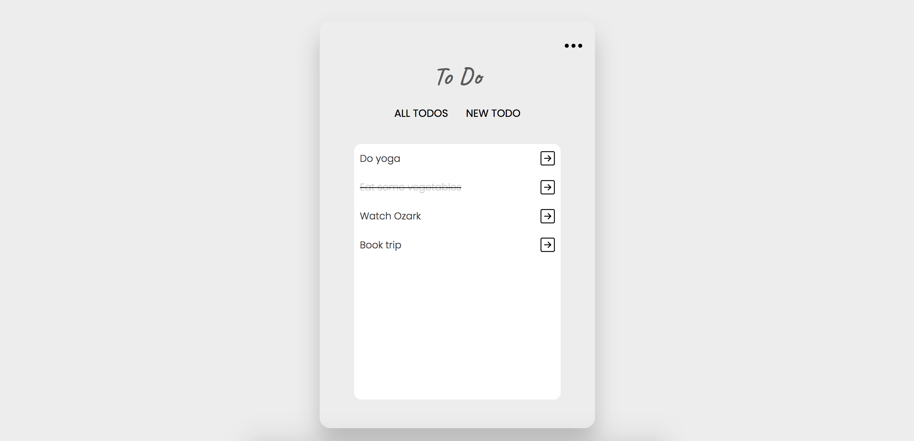

# To Do App
To do app built with Node.js, Express.js, Handlebars and MongoDB 📝

This was a school assignment where the goal was to learn and develop skills in Node.js, Express.js, template engines and MongoDB.

## Users should be able to:
- Perform all CRUD operations on todos
- Display tasks depending on completed/not completed
- Sort tasks based on when they were created, newest → oldest and oldest → newest

## Built with
- HTML & CSS
- JavaScript
- Node.js
- Express.js
- Handlebars
- MongoDB

## Author
- GitHub - [malin-nilsson](https://github.com/malin-nilsson)
